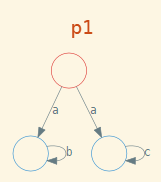

# Process Modeling and Verification

## Labeled Transition Systems (LTS)

Labelled transition systems are abstract models of processes.  (**S**,**a**); **S**: set of states, **a**: set of actions
A labelled transition system (LTS)over an alphabet A is a pair (S,α) where S is a set and α ⊆ S×A×S.  The elements of S are called states or processes and α is called transition relation.  Instead of (s,a,s′) ∈ α one often writes s<sub>a</sub>→<sup>α</sup>s′, or just s<sub>a</sub>→s′ if the transition relation  is  clear  from  the  context.   The  elements  of  the  alphabet A are  called labels or actions or events. 

### Deterministic LTS

An LTS is **Deterministic** if there are no transitions s<sub>a</sub>→t1 and s<sub>a</sub>→t2 with t1 != t2.

> Bellow we can see a **NON-Deterministic** LTS. It's non-deterministic because we can make two different transitions with the same action **a**
> p1 = a -> p2    []    p1 = a -> p3;    p1 != p2



The difference between *finite automata* and *labelled transition systems* is that in an LTS no initial state and no final states are specified and the set of states need not be finite.

### Traces

The set of traces, Traces(s), of a process s is a set of words over the alphabet A defined as follows:
For any word w and process s we define when w ∈ Traces(s) holds by recursion on w (we write〈〉for the empty word and〈a〉_ w for the concatenation of a letter with a word, for example,〈a〉_ ab=aab ):

1. 〈〉∈ Traces(s) holds for every process s∈S.
2. 〈a〉_ w ∈ Traces(s) holds if there exists s′∈S such that s<sub>a</sub>→s′ and w ∈ Traces(s′).

The set Traces(s) may be viewed as the set of possible sequences of actions the process *s* is able to perform.


> Traces(t0) = {<>, <a>, <a,b>, <a,c>} 
> or simply : 
> Traces(t0) = {<>, a, ab, ac}

### Bi-simulation & Coinduction

**Bisimulation** is a relation between states of two LTSs by which for every action in one LTS there is an equivalent action in the other LTS.
Suppose we have two LTS systems: (**S**,**a**) and (**T**,**b**) then two states **s** in **S** and **b** in **T** are **bisimilar** if there exists a bisimulation relation such that: **s**~**t** if **s** R **t**


- s R t is read: s is in relation (R) with t
- in (1), s' R t' means that we should recursively check all the subsequent states of t for the bisimulation relation

Bisimulation is the **strong notion** of equivalence of two processes while trace equivalency is a **weak notion** of process equivalence.


We will be using CSP:

```
channel onEvent, playEvent, offEvent, crashEvent, powerOutageEvent
OFF_STATE = (onEvent -> ON_STATE [] powerOutageEvent -> STOP)
DEAD_STATE = STOP
ON_STATE = (playEvent -> ON_STATE [] offEvent -> OFF_STATE [] crashEvent -> DEAD_STATE)
```

